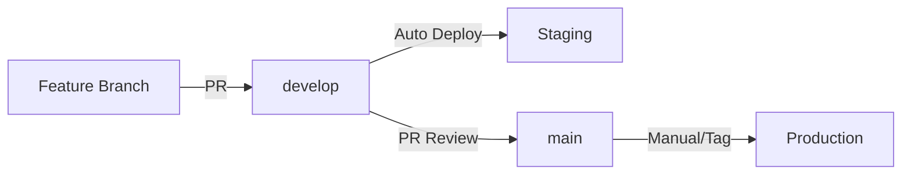

# GIT WORKFLOW – Miele System

> Estratégia de branches e workflow de desenvolvimento para o Miele System.

---

## 🌿 Estratégia de Branches

### Branches Principais

#### `main` - Produção
- **Propósito**: Código estável e pronto para produção
- **Proteção**: Branch protegida, apenas via Pull Request
- **Deploy**: Manual ou via tags de release
- **Qualidade**: Todos os testes devem passar

#### `develop` - Desenvolvimento
- **Propósito**: Integração contínua e staging
- **Deploy**: Automático no Render.com
- **Origem**: Features são mergeadas aqui
- **Estabilidade**: Testado, mas pode ter bugs menores

### Branches de Trabalho

#### `feature/*` - Novas Funcionalidades
```bash
# Nomenclatura
feature/authentication-system
feature/client-management
feature/perdcomp-crud
feature/admin-dashboard

# Exemplo de criação
git checkout develop
git pull origin develop
git checkout -b feature/client-notes-system
```

#### `bugfix/*` - Correção de Bugs
```bash
# Nomenclatura
bugfix/login-error-handling
bugfix/client-validation-fix
bugfix/perdcomp-upload-issue

# Exemplo de criação
git checkout develop
git pull origin develop
git checkout -b bugfix/authentication-token-refresh
```

#### `hotfix/*` - Correções Urgentes
```bash
# Nomenclatura
hotfix/critical-security-patch
hotfix/database-connection-fix

# Criado a partir de main para correções urgentes
git checkout main
git pull origin main
git checkout -b hotfix/security-vulnerability-fix
```

---

## 🔄 Fluxo de Desenvolvimento

### 1. Nova Feature

```bash
# 1. Criar branch a partir de develop
git checkout develop
git pull origin develop
git checkout -b feature/nova-funcionalidade

# 2. Desenvolver e commitar
git add .
git commit -m "feat: adicionar sistema de anotações de clientes"
git push origin feature/nova-funcionalidade

# 3. Abrir Pull Request para develop
# 4. Code review e aprovação
# 5. Merge via GitHub/GitLab
# 6. Deploy automático no staging (develop)
```

### 2. Bugfix

```bash
# 1. Criar branch a partir de develop
git checkout develop
git pull origin develop
git checkout -b bugfix/correcao-validacao

# 2. Corrigir e testar
git add .
git commit -m "fix: corrigir validação de CNPJ"
git push origin bugfix/correcao-validacao

# 3. Pull Request para develop
# 4. Merge após aprovação
```

### 3. Release para Produção

```bash
# 1. Criar Pull Request de develop para main
# 2. Code review final e aprovação
# 3. Merge para main
# 4. Tag de release
git checkout main
git pull origin main
git tag -a v1.2.0 -m "Release v1.2.0: Sistema de anotações"
git push origin v1.2.0

# 5. Deploy manual para produção (se necessário)
```

### 4. Hotfix Crítico

```bash
# 1. Branch a partir de main
git checkout main
git pull origin main
git checkout -b hotfix/vulnerabilidade-critica

# 2. Correção rápida
git add .
git commit -m "fix: corrigir vulnerabilidade de segurança"
git push origin hotfix/vulnerabilidade-critica

# 3. PR para main (primeiro)
# 4. Merge e deploy imediato
# 5. Merge de volta para develop
git checkout develop
git merge main
git push origin develop
```

---

## 📝 Convenções de Commit

### Padrão Conventional Commits

```bash
<type>[optional scope]: <description>

[optional body]

[optional footer(s)]
```

### Tipos de Commit

| Tipo | Descrição | Exemplo |
|------|-----------|---------|
| `feat` | Nova funcionalidade | `feat(auth): adicionar autenticação 2FA` |
| `fix` | Correção de bug | `fix(clients): corrigir validação de CNPJ` |
| `docs` | Documentação | `docs: atualizar README com deploy` |
| `style` | Formatação/estilo | `style: aplicar black em todos os arquivos` |
| `refactor` | Refatoração | `refactor(services): extrair lógica de upload` |
| `test` | Testes | `test(clients): adicionar testes de integração` |
| `chore` | Tarefas de manutenção | `chore: atualizar dependências` |
| `perf` | Performance | `perf(db): otimizar queries de clientes` |
| `ci` | CI/CD | `ci: adicionar workflow de testes` |

### Exemplos Práticos

```bash
# Feature
git commit -m "feat(perdcomps): adicionar upload de anexos via Google Drive"

# Bugfix
git commit -m "fix(auth): corrigir expiração de refresh token"

# Breaking change
git commit -m "feat(api)!: modificar estrutura de resposta de clientes

BREAKING CHANGE: campo 'address' agora é objeto aninhado"

# Múltiplas linhas
git commit -m "feat(admin): adicionar dashboard de aprovações

- Adicionar listagem de requests pendentes
- Implementar ações de aprovação em lote
- Adicionar filtros por tipo e data
- Incluir métricas de performance"
```

---

## 🔍 Code Review

### Checklist de Pull Request

#### Código
- [ ] **Funcionalidade** implementada conforme especificação
- [ ] **Testes** adicionados/atualizados
- [ ] **Documentação** atualizada se necessário
- [ ] **Linting** passou (ruff, black, isort)
- [ ] **Migrações** incluídas se necessário

#### Segurança
- [ ] **Não há** credenciais ou secrets no código
- [ ] **Validações** adequadas nos inputs
- [ ] **Permissões** corretas implementadas
- [ ] **SQL Injection** prevenido

#### Performance
- [ ] **Queries** otimizadas
- [ ] **N+1 queries** evitadas
- [ ] **Caching** considerado onde apropriado
- [ ] **Paginação** implementada em listas

### Template de Pull Request

```markdown
## 📋 Descrição
Breve descrição das mudanças implementadas.

## 🎯 Tipo de Mudança
- [ ] Nova funcionalidade (feat)
- [ ] Correção de bug (fix)
- [ ] Refatoração (refactor)
- [ ] Documentação (docs)
- [ ] Outros

## 🧪 Testes
- [ ] Testes unitários adicionados/atualizados
- [ ] Testes de integração verificados
- [ ] Testes manuais realizados

## 📚 Documentação
- [ ] README atualizado
- [ ] Documentação técnica atualizada
- [ ] Comentários no código adequados

## 🔗 Issues Relacionadas
Closes #123
Fixes #456

## 📸 Screenshots (se aplicável)
...

## ✅ Checklist Final
- [ ] Código testado localmente
- [ ] Migrações funcionando
- [ ] Linting passou
- [ ] Sem breaking changes (ou documentado)
```

---

## 🚀 Deploy Strategy

### Ambientes

#### Development
- **Branch**: `feature/*`, `bugfix/*`
- **Deploy**: Local ou preview temporário
- **Database**: SQLite local
- **Storage**: Local filesystem

#### Staging
- **Branch**: `develop`
- **Deploy**: Automático via Render.com
- **Database**: PostgreSQL (shared)
- **Storage**: Google Drive (test folders)
- **URL**: `https://miele-system-staging.onrender.com`

#### Production
- **Branch**: `main`
- **Deploy**: Manual ou via tags
- **Database**: PostgreSQL (dedicado)
- **Storage**: Google Drive (production folders)
- **URL**: `https://miele-system.onrender.com`

### Pipeline de Deploy



---

## 🛡️ Branch Protection Rules

### `main` Branch
```yaml
Required status checks:
  - All tests passing
  - Code review approved
  - No conflicts with base branch
  
Restrictions:
  - Require pull request reviews: 1
  - Dismiss stale reviews: true
  - Require review from code owners: true
  - Require status checks to pass: true
  - Require branches to be up to date: true
  - No force pushes
  - No deletions
```

### `develop` Branch
```yaml
Required status checks:
  - All tests passing
  - No conflicts with base branch
  
Restrictions:
  - Require pull request reviews: 1
  - Require status checks to pass: true
  - Allow force pushes: false
  - No deletions
```

---

## 🔧 Git Configuration

### Configuração Inicial

```bash
# Configuração global
git config --global user.name "Seu Nome"
git config --global user.email "seu.email@compasse.com"
git config --global core.autocrlf input  # Linux/Mac
git config --global core.autocrlf true   # Windows
git config --global pull.rebase false
git config --global push.default simple

# Aliases úteis
git config --global alias.co checkout
git config --global alias.br branch
git config --global alias.ci commit
git config --global alias.st status
git config --global alias.unstage 'reset HEAD --'
git config --global alias.last 'log -1 HEAD'
git config --global alias.visual '!gitk'
```

### .gitignore

```gitignore
# Python
__pycache__/
*.py[cod]
*$py.class
*.so
.Python
env/
venv/
ENV/
env.bak/
venv.bak/

# Django
*.log
local_settings.py
db.sqlite3
db.sqlite3-journal
media/

# Environment
.env
.env.local
.env.production

# IDE
.vscode/
.idea/
*.swp
*.swo

# OS
.DS_Store
Thumbs.db

# Backup files
*.bak
*.tmp
*.temp

# Google Drive credentials (local dev)
integration/google-drive/token.json
integration/google-drive/credentials.json
```

---

## 📊 Monitoring e Métricas

### Branch Metrics

```bash
# Commits por branch
git shortlog -s -n --all

# Estatísticas de contribuição
git log --format='%aN' | sort -u | wc -l

# Activity por período
git log --since="1 month ago" --oneline | wc -l
```

### Code Quality

```bash
# Pre-commit hooks
pip install pre-commit
pre-commit install

# .pre-commit-config.yaml
repos:
  - repo: https://github.com/psf/black
    rev: 23.1.0
    hooks:
      - id: black
  
  - repo: https://github.com/pycqa/isort
    rev: 5.12.0
    hooks:
      - id: isort
  
  - repo: https://github.com/charliermarsh/ruff-pre-commit
    rev: v0.0.254
    hooks:
      - id: ruff
```

---

## 🚨 Emergency Procedures

### Rollback Rápido

```bash
# 1. Identificar último commit estável
git log --oneline -10

# 2. Criar hotfix para reverter
git checkout main
git checkout -b hotfix/rollback-problematic-feature
git revert abc123def  # commit problemático
git push origin hotfix/rollback-problematic-feature

# 3. PR emergencial e merge
# 4. Deploy imediato
```

### Recovery de Branch

```bash
# Branch deletada acidentalmente
git reflog
git checkout -b feature/recovered-branch abc123def

# Commits perdidos
git fsck --lost-found
git show <commit-hash>
```

---

## 📚 Recursos e Treinamento

### Comandos Essenciais

```bash
# Workflow diário
git status
git pull origin develop
git checkout -b feature/nova-funcionalidade
git add .
git commit -m "feat: implementar funcionalidade"
git push origin feature/nova-funcionalidade

# Atualizar branch com develop
git checkout feature/minha-branch
git pull origin develop
git merge develop  # ou git rebase develop

# Limpar branches antigas
git branch -d feature/branch-mergeada
git remote prune origin
```

### Links Úteis

- **Git Documentation**: [git-scm.com/doc](https://git-scm.com/doc)
- **Conventional Commits**: [conventionalcommits.org](https://www.conventionalcommits.org)
- **GitHub Flow**: [guides.github.com/introduction/flow](https://guides.github.com/introduction/flow)
- **Git Best Practices**: [git-scm.com/book](https://git-scm.com/book)

---