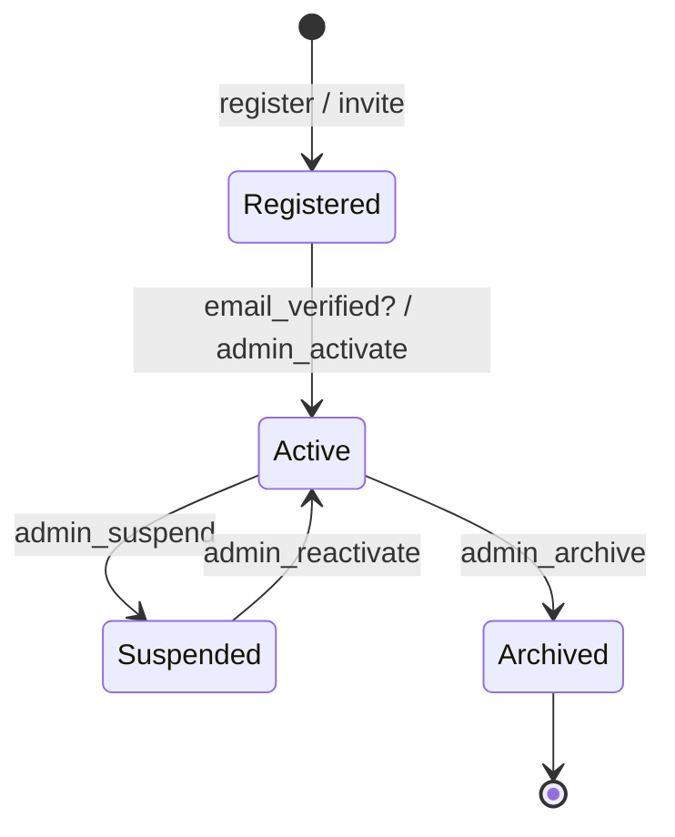
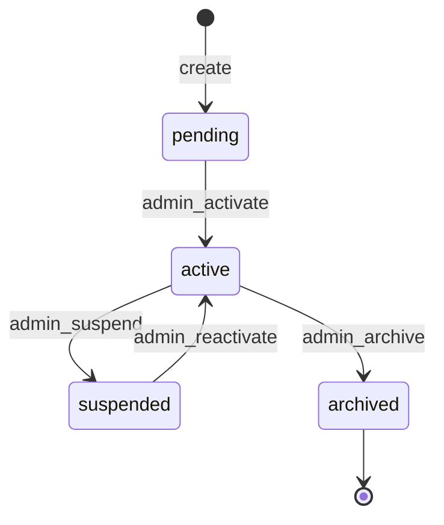
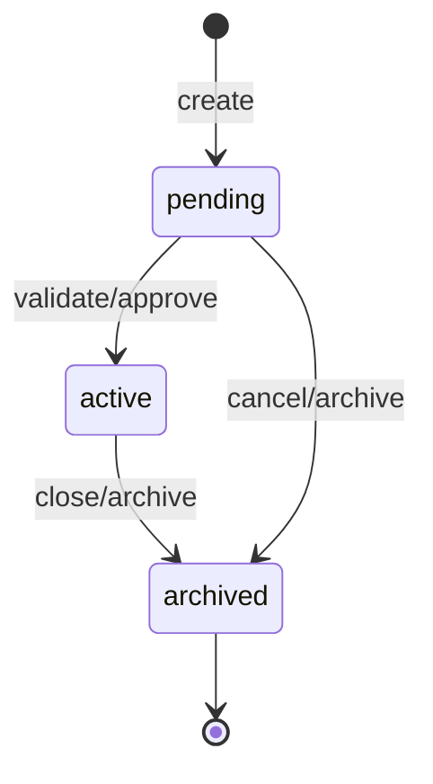
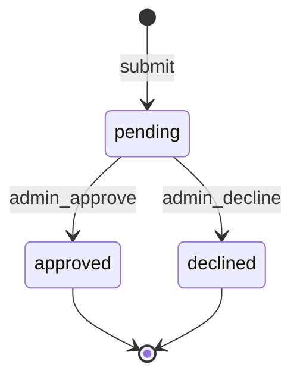
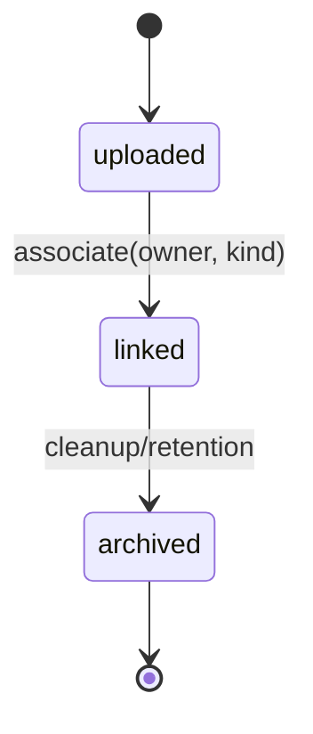

# USE-CASES – Miele System (v1)

> Guia de casos de uso, matrizes de acesso e ciclos de vida das entidades do **Miele System – Gestor Empresarial**.  
> Este documento complementa **ESCOPO.md**, **ARQUITETURA.md**, **ENDPOINTS.md** e **ADMIN.md**.

---

## 1. Papéis, Perfis e Princípios de Acesso

### Papéis

- **Guest**: Não autenticado. Acesso apenas a rotas públicas (ex.: páginas informativas, *health checks*, documentação de API se habilitada).
- **Employee**: Usuário autenticado padrão (colaborador interno do cliente ou usuário comum). Permissões limitadas conforme **RBAC** (grupos/permissões do Django).
- **Admin**: Superusuário operacional da Compasse. Pode realizar ações administrativas globais e aprovar fluxos sensíveis.

> **Pirâmide invertida de autorização**: Se **Employee** pode, **Admin** também pode (salvo exceções explícitas por auditoria/sigilo).

### Princípios

- **JWT** curto + **Refresh com rotação e blacklist** (SimpleJWT).
- **RBAC** via `Group`/`Permission` nativos do Django.
- **Rate limit** agressivo em `/auth/*`, throttling DRF por *view*.
- **Auditoria** obrigatória para eventos críticos (criação/alteração/exclusão, aprovações).
- **Erros padronizados** (envelope em `ENDPOINTS.md`).

---

## 2. Matriz de Capacidades (Alto Nível)

| Capacidade | Guest | Employee | Admin |
|------------|:-----:|:--------:|:-----:|
| Autenticar (login/refresh/logout) | ✅ (login) | ✅ | ✅ |
| Gerenciar próprio perfil (nome, e-mail, senha) | ❌ | ✅ | ✅ (qualquer usuário) |
| Visualizar clientes (dados não sensíveis) | ❌ | ✅ (do seu contexto/tenant) | ✅ (global) |
| Criar/editar cliente | ❌ | ❌ (solicita) | ✅ |
| Ações sensíveis do cliente (alterar CNPJ, arquivar) | ❌ | ❌ (requer aprovação) | ✅ (via aprovação) |
| Submeter **Requests** de alteração sensível | ❌ | ✅ | ✅ |
| Aprovar/recusar **Requests** | ❌ | ❌ | ✅ |
| Gerenciar PER/DCOMP (criar, anexar arquivos, acompanhar status) | ❌ | ✅ (do seu cliente) | ✅ (global) |
| Gerenciar anexos (upload/download) | ❌ | ✅ (com escopo) | ✅ |
| Acessar Django Admin/Backoffice | ❌ | 🔒 (apenas se explicitamente autorizado) | ✅ |
| Visualizações públicas (read‑only endpoints marcados como *guest*) | ✅ | ✅ | ✅ |

> **Observação**: “Employee” é o usuário autenticado “normal”. Permissões específicas são refinadas por `Permission` (DRF) por rota.

---

## 3. Entidades Principais e Regras Gerais

### 3.1 User / Identity

- **Criação**: Via `/auth/register` (política aplicável) ou *onboarding* interno.
- **Autenticação**: `/auth/login` → `access` (curto) + `refresh` (cookie httpOnly preferencial) com **rotação + blacklist**.
- **Gestão própria**: Atualizar nome/e-mail/senha, ver sessões ativas, *logout* global (revogação de refresh).
- **Permissões**: Associadas por `Groups` e `Permissions`.
- **Auditoria**: Login/logout, mudança de senha/email, alteração de grupos.

### 3.2 Client (Empresa)

- Define escopo de dados para Employees.
- Campos sensíveis (ex.: **CNPJ**) exigem **Request/Aprovação**.
- **Status**: `pending` → `active` → `suspended` → `archived`.
- **Ações**: Criar, atualizar metadados, suspender/reativar, arquivar.
- **Regra**: Exclusão física evitada; utilizar *soft delete* ou `archived`.

### 3.3 PER/DCOMP

- Representa processos/documentos fiscais do cliente.
- **Status**: `pending` → `active` → `archived` (ou cancelado conforme regra).
- Alterações críticas (ex.: valores, identificadores oficiais) podem exigir **Request**.
- **Arquivos** associados (recibos, pedidos, resumo, genéricos).

### 3.4 File (Anexo)

- Metadados: `owner` (`client` | `perdcomp`), `kind` (`generic`, `recibo`, `pedido_recebimento`, `perdcomp_summary`), `storage_backend` (`local` | `s3`).
- **Permissões**: Leitura restrita ao contexto (do cliente) e papel.
- **Integridade**: Verificar *content-type*, tamanho, antivírus (opcional), *checksum* (opcional).

### 3.5 Request (Change/Aprovação)

- **Subject**: `user | client | perdcomp`.
- **Action** (exemplos): `user_activate`, `client_sensitive_update`, `perdcomp_sensitive_update`, `*_delete`.
- **Status**: `pending` → `approved | declined`.
- **Efeitos**: Ao aprovar, executar mutação associada; ao recusar, manter estado original.
- **Auditoria**: Quem solicitou, quem aprovou/recusou, *payload* e *reason*.

> **Padrões**: Paginação padrão DRF, `django-filter` para filtros, `SearchFilter/OrderingFilter`, erros padronizados, `correlation_id` em todas as requisições.

---

## 4. Ciclos de Vida por Entidade

### 4.1 User

**Regras e Ações**

- `register` (Guest) → cria usuário em `Registered` (ou `Active`, conforme política).
- Verificação de e-mail (opcional) → transição para `Active`.
- **Employee**: Edita próprio perfil (nome, e-mail, senha).
- **Admin**: Pode ativar/suspender/arquivar usuários e gerenciar grupos/permissões.
- **Logout global**: Revoga todos os refresh tokens (blacklist).
- **Auditoria**: Registrar alterações de perfil/permissões.

### 4.2 Client

**Regras e Ações**

- **Criação**: Apenas **Admin**.
- **Update sensível** (ex.: CNPJ): Via **Request** (`client_sensitive_update`).
- **Suspensão**: Bloqueia operações mutáveis; leitura permitida conforme política.
- **Arquivamento**: Leitura histórica preservada; mutações bloqueadas.
- **Auditoria**: Todas as transições + *payload* de mudança.

### 4.3 PER/DCOMP

**Regras e Ações**

- **Criação**: **Employee** (escopo do seu cliente) ou **Admin**.
- **Ativar**: Após validações/documentos requeridos.
- **Atualizações sensíveis**: Via **Request** (`perdcomp_sensitive_update`).
- **Arquivar/Encerrar**: Por conclusão, cancelamento ou *housekeeping* de retenção.
- **Auditoria**: Criação, ativações, atualizações sensíveis, arquivamento.

### 4.4 Request (Approvals)

**Regras e Ações**

- **Submit**: **Employee** ou **Admin** (quando precisa *two‑man rule*).
- **Approve/Decline**: Somente **Admin** (ou aprovador designado).
- **Side‑effects**: Executar mutação atômica no alvo; gerar **AuditLog**.
- **Idempotência**: Múltiplos *approve* não devem duplicar efeitos.

### 4.5 File (Anexos)

**Regras e Ações**

- `uploaded` → Armazenamento no backend (`local`/`s3`) + metadados.
- `linked` → Associação obrigatória a `client` ou `perdcomp` (via `owner`).
- Validações: Tamanho, tipo, vírus (opcional), checksum (opcional).
- **Acesso**: Somente ao escopo do cliente e papel autorizado.
- **Retenção**: Política de *cleanup* (Celery Beat) move para `archived` conforme tempo.

---

## 5. Casos de Uso Detalhados (End‑to‑End)

### UC‑01 – Login e Sessão Segura

**Atores**: Guest → Employee

**Fluxo**:

1. Guest envia credenciais para `/auth/login`.
2. Sistema retorna `access` (header `Authorization`) e `refresh` (cookie httpOnly Secure).
3. Employee acessa recursos do seu cliente conforme RBAC.
4. Ao expirar `access`, Employee usa `/auth/refresh` (rotação + blacklist do anterior).
5. Logout global → revoga *refresh* e invalida sessões.

**Regras**: Throttling agressivo, bloqueio após tentativas, `correlation_id` logado.

---

### UC‑02 – Atualização de Perfil do Usuário

**Atores**: Employee

**Fluxo**:

1. Autenticado, envia PATCH para `/users/me` (nome/e-mail) ou `/users/me/password`.
2. Sistema valida senha atual (se necessário) e registra auditoria.
3. Notifica via e-mail (opcional) alterações críticas.

**Regras**: Verificação de e-mail pode ser reemitida após troca de e-mail.

---

### UC‑03 – Cadastro de Cliente

**Atores**: Admin

**Fluxo**:

1. Admin cria `Client` (`pending`).
2. Valida documentos (se aplicável) → `active`.
3. Admin convida/atribui Employees ao cliente (via grupos/permissões).

**Regras**: CNPJ único; dados sensíveis bloqueados sem aprovação.

---

### UC‑04 – Alteração Sensível de Cliente (CNPJ)

**Atores**: Employee (solicita) / Admin (aprova)

**Fluxo**:

1. Employee submete **Request**: `subject=client`, `action=client_sensitive_update`, `payload={novo_cnpj}`.
2. Admin avalia (dados + documentos) e **approve/decline**.
3. Se **approved** → sistema executa mutação atômica e registra **AuditLog**.

**Regras**: Duplicidade de CNPJ bloqueia aprovação; razões registradas.

---

### UC‑05 – Gestão de PER/DCOMP com Anexos

**Atores**: Employee / Admin

**Fluxo**:

1. Criar PER/DCOMP (`pending`).
2. Fazer upload de anexos com `owner=perdcomp` e `kind` apropriado (ex.: `recibo`).
3. Após validação, mover para `active`.
4. Atualizações sensíveis → via **Request** (se exigidas).
5. Encerrar/arquivar ao fim do processo.

**Regras**: Controle de acesso por cliente; registro de todas as mudanças.

---

### UC‑06 – Aprovação de Requests

**Atores**: Admin

**Fluxo**:

1. Listar requests `pending`.
2. Abrir detalhes (payload, solicitante, *diff* esperado).
3. Aprovar ou recusar.
4. Sistema aplica efeito (quando aprovado) e audita.

**Regras**: Idempotência; *webhooks* ou e-mails (opcional).

---

## 6. Regras Transversais e Invariantes

- **Tenant/Contexto**: Todo acesso de Employee é **scoped** ao seu `Client` (ou conjunto de clientes autorizado).
- **Idempotência**: Endpoints de aprovação/mutação sensível devem ser resistentes a *retries*.
- **Soft‑delete/Arquivamento**: Preferir arquivar em vez de excluir. Dados históricos devem permanecer consultáveis conforme política.
- **Observabilidade**: Logs estruturados (JSON), `request_id`, métricas, Sentry.
- **Segurança**: CORS estrito, headers seguros, HTTPS obrigatório, CSRF ativo para rotas web (quando aplicável).
- **Paginação e Filtros**: Consistentes com `ENDPOINTS.md` (PageNumberPagination + filtros padrão).
- **Envelope de Erros**: Sempre no formato unificado (vide documentação de API).

---

## 7. Critérios de Aceite (DoR/DoD) por Fluxo

- **Autenticação**: Throttling ativo; tokens seguros; rotas `/auth/*` testadas (unit/integration).
- **Perfil**: Mudanças registradas em **AuditLog** + notificação opcional.
- **Cliente**: Transições de estado cobertas por testes; *requests* exigidas para campos sensíveis.
- **PER/DCOMP**: Anexos validados; estado e histórico consistentes; políticas de retenção testadas.
- **Approvals**: Lista/filtro por status; *approve/decline* atômicos; idempotência verificada.
- **Admin Backoffice**: Ações restritas; 2FA opcional; logs de auditoria exibidos.

---

## 8. Backoffice (Django Admin) – Expectativas de Uso

- **Login** restrito (RBAC + 2FA opcional).
- **Vistas customizadas**: Requests pendentes, auditoria, saúde do sistema, *feature flags*.
- **Ações em massa**: Aprovar/recusar *requests* com justificativa.
- **Proteções**: Confirmação dupla para ações irreversíveis, *read‑only* para dados sensíveis por padrão.

---

## 9. Tarefas Recorrentes e Retenção

- **Celery Beat**: Limpeza de tokens expirados, rotação de *sessions*, retenção de anexos antigos (mover para `archived`).
- **SLA de Retenção**: Definir prazos legais/operacionais por tipo de documento (configurável por ambiente).

---

## 10. Checklist de Implementação (Resumo)

- [ ] RBAC aplicado por *viewset* (DRF Permissions) e por grupos.
- [ ] Endpoints sensíveis protegidos por **Requests/Aprovação**.
- [ ] Auditoria completa nos eventos críticos.
- [ ] Estados/transições modelados e testados para **User**, **Client**, **PER/DCOMP**, **File**, **Request**.
- [ ] Upload seguro (validação, limites, backend S3 em prod).
- [ ] Observabilidade (logs JSON, Sentry, health checks).
- [ ] Documentação OpenAPI atualizada (drf‑spectacular) com exemplos de erros.
- [ ] Testes (unit/integration/e2e) dos fluxos UC‑01 … UC‑06.

---

**Fim – USE‑CASES v1**  
Alinhar este documento sempre que **ENDPOINTS.md** ou **ESCOPO.md** forem atualizados.

